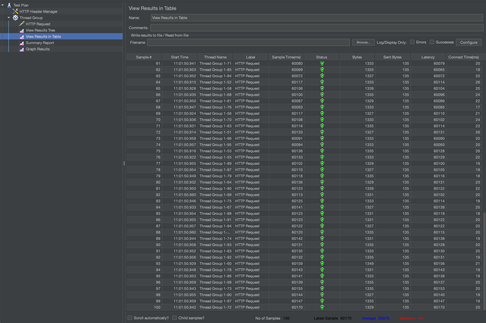
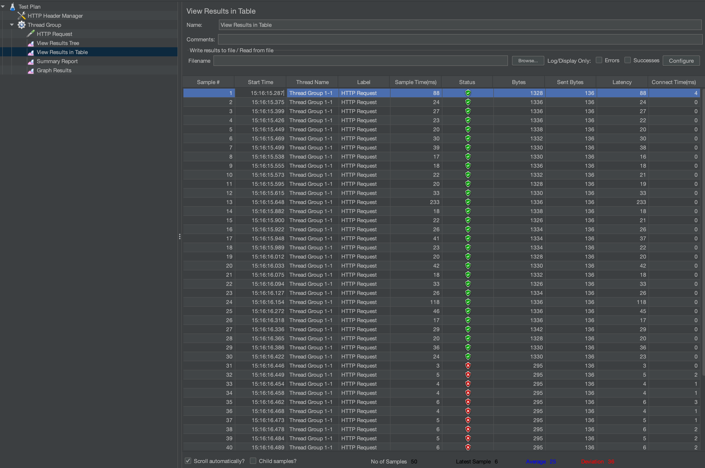

# Issue Gravitee 3.X JDBC

```
docker-compose up --build
```

To reproduce the bug I created a script `test.sh`. It will be necessary to replace the URL & API Key by yours. Then you will need to run  `main-test.sh` which will create 3 *.txt files corresponding to 3 threads.
By configuring a rate limit of 100 max requests / minute, you will see by counting the values in http-code: 200  that the result is not consistent and allows more requests than 100.

## JMeter

Rate-limits is 30. JMeter sends 50 requests with 100 users (number of threads)

### With JDBC & PostgreSQL



### With MongoDB


